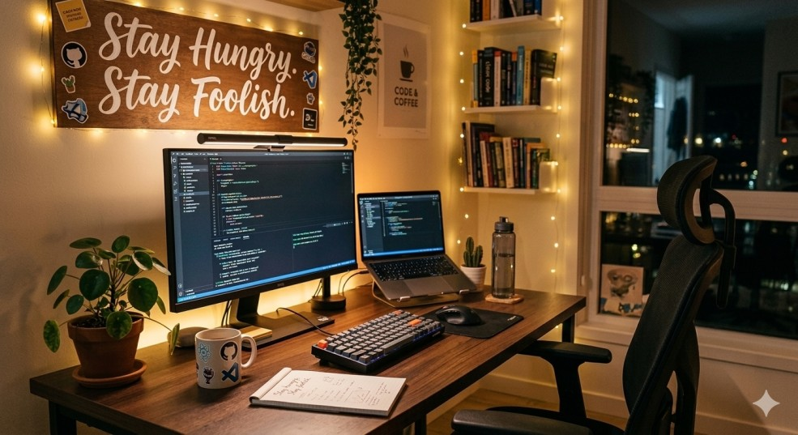

<!-- ----------- HEAD SECTION ------------ -->

  

 

<!-- ----------- HEAD SECTION END ------------ -->

  

<!--
Personalized GitHub Stats Card
just replace the username param to your github username.
For more info and customization, read, https://github.com/anuraghazra/github-readme-stats
-->

* This is Tannistha Pal. I work on Machine Learning Projects, and am interested in Data Science & Artificial Intelligence. I also build repositories with automation/competititive coding/utility problems solved over different domains using Python.
* I am a 4th year undergraduate under the department of Electronics and Communications Engineering in [Institute of Engineering & Managemnet, Kolkata](https://iem.edu.in/).

***
 

<!--
The number of github profile or any other repo view.
just replace the username param to your github username.
For more info and customization, read, https://github.com/antonkomarev/github-profile-views-counter
-->

**Languages and Tools:**  

<!--
To get your topics goto https://github.com/topics
Search for your topics, then open image of the icons that appear there and get that link.
Then paste the links along with the alt text. (optional)
-->

 
 

***

-  🔭 I’m currently working on projects related to Machine Learning, Computer Vision, Deep Learning and Data Analytics.

-  🌱 I’m currently learning how to deploy Software Projects using Flask/Flutter and their custom implementation in the development of Web/Mobile Applications.I have engaged myself in projects in the domain of Artificial Intelligence and Machine Learning. You can find my work [in these repos](https://github.com/paltannistha?tab=repositories). 
-  👯 I’m looking forward to collaborate on projects for better software and contributing towards Open Source.

-  😄 Pronouns: She/Her

<!-- ----------- CONNECT WITH ME SECTION ------------ -->

***
<!--
Links with Badges.
The %40 is for the @ sign.
You can either change the link or customize the links at https://shields.io/ or you can search logos on google too.
Replacing my text with yours would also work however.
-->

### Show some ❤️ by starring some of the repositories!

